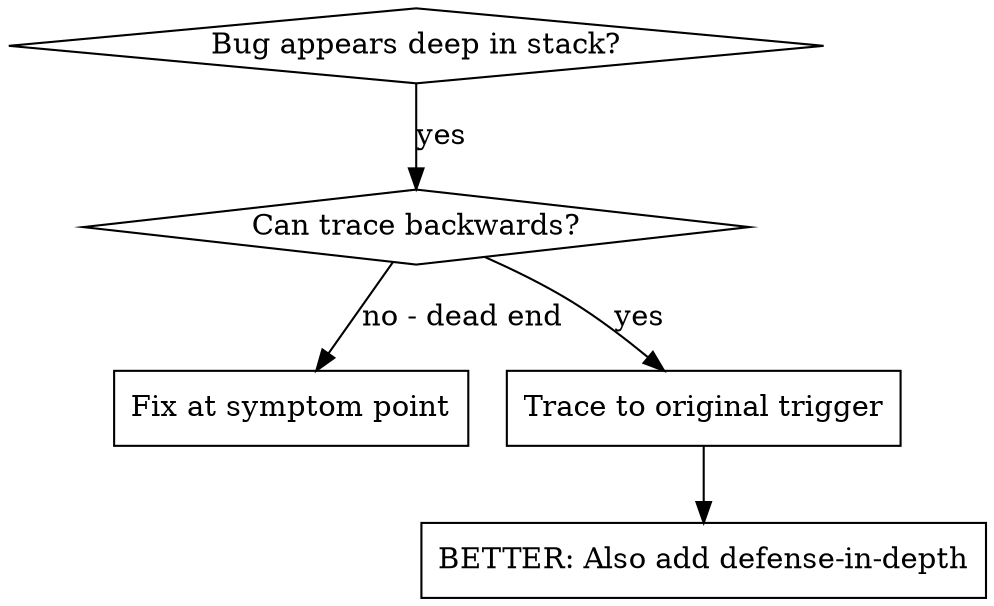
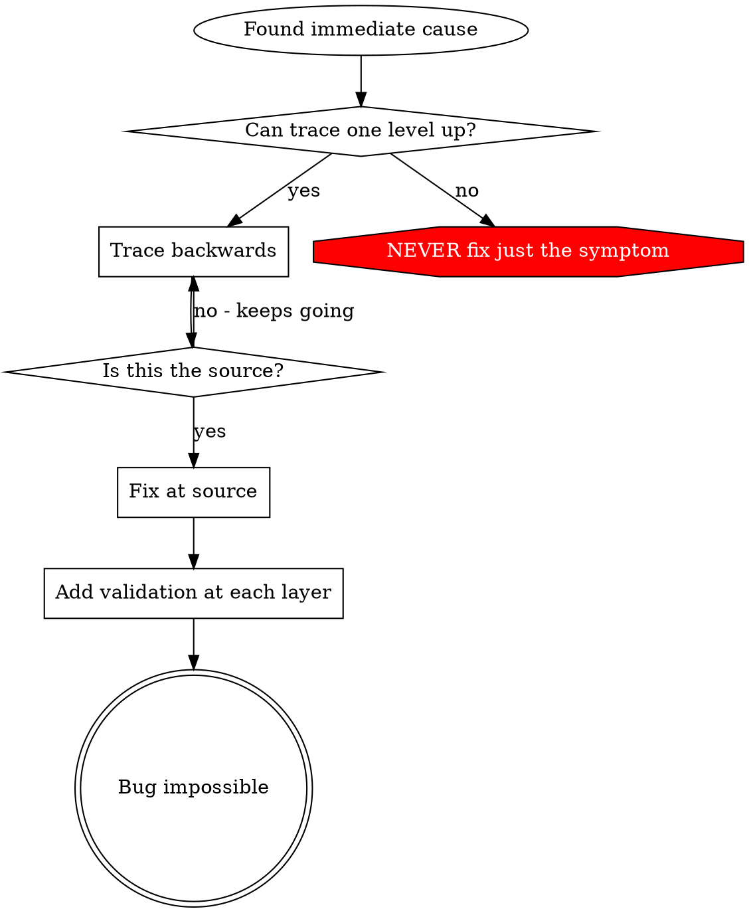

# Root Cause Tracing

## Overview

Bugs often manifest deep in the call stack (git init in wrong directory, file created in wrong location, database opened with wrong path). Your instinct is to fix where the error appears, but that's treating a symptom.

**Core principle:** Trace backward through the call chain until you find the original trigger, then fix at the source.

## When to Use



**Use when:**
- Error happens deep in execution (not at entry point)
- Stack trace shows long call chain
- Unclear where invalid data originated
- Need to find which test/code triggers the problem

## The Tracing Process

### 1. Observe the Symptom
```
Error: git init failed in ~/project/packages/core
```

### 2. Find Immediate Cause
**What code directly causes this?**
```ruby
system('git', 'init', chdir: project_dir)
```

### 3. Ask: What Called This?
```ruby
WorktreeManager.create_session_worktree(project_dir, session_id)
  # → called by Session#initialize_workspace
  # → called by Session.create
  # → called by spec at Project.create
```

### 4. Keep Tracing Up
**What value was passed?**
- `project_dir = ''` (empty string!)
- Empty string as `chdir` falls back to `Dir.pwd`
- That's the source code directory!

### 5. Find Original Trigger
**Where did empty string come from?**
```ruby
let(:context) { setup_core_test }  # Returns { temp_dir: '' }
Project.create('name', context[:temp_dir])  # Accessed before the before hook ran!
```

## Adding Stack Traces

When you can't trace manually, add instrumentation:

```ruby
# Before the problematic operation
def git_init(directory)
  warn "DEBUG git init: #{{
    directory: directory,
    cwd: Dir.pwd,
    rails_env: ENV['RAILS_ENV'],
    stack: caller.join("\n"),
  }.inspect}"

  system('git', 'init', chdir: directory)
end
```

**Critical:** Use `warn` / `$stderr.puts` in tests (not the logger - may be suppressed)

**Run and capture:**
```bash
bundle exec rspec 2>&1 | grep 'DEBUG git init'
```

**Analyze stack traces:**
- Look for test file names
- Find the line number triggering the call
- Identify the pattern (same test? same parameter?)

## Finding Which Test Causes Pollution

If something appears during tests but you don't know which test:

Use the bisection script `find-polluter.sh` in this directory:

```bash
./find-polluter.sh '.git' 'spec/**/*_spec.rb'
```

Runs tests one-by-one, stops at first polluter. See script for usage.

## Real Example: Empty projectDir

**Symptom:** `.git` created in `packages/core/` (source code)

**Trace chain:**
1. `git init` runs in `Dir.pwd` ← empty chdir parameter
2. WorktreeManager called with empty projectDir
3. Session.create() passed empty string
4. Spec accessed `context[:temp_dir]` before the `before` hook
5. `setup_core_test` returns `{ temp_dir: '' }` initially

**Root cause:** Top-level variable initialization accessing empty value

**Fix:** Made temp_dir a method that raises if accessed before the `before` hook

**Also added defense-in-depth:**
- Layer 1: Project.create() validates directory
- Layer 2: WorkspaceManager validates not empty
- Layer 3: Rails.env guard refuses git init outside tmpdir
- Layer 4: Stack trace logging before git init

## Key Principle



**NEVER fix just where the error appears.** Trace back to find the original trigger.

## Stack Trace Tips

**In tests:** Use `warn` / `$stderr.puts` not the logger - logger may be suppressed
**Before operation:** Log before the dangerous operation, not after it fails
**Include context:** Directory, cwd, environment variables, timestamps
**Capture stack:** `caller` shows complete call chain

## Real-World Impact

From debugging session (2025-10-03):
- Found root cause through 5-level trace
- Fixed at source (getter validation)
- Added 4 layers of defense
- 1847 tests passed, zero pollution
